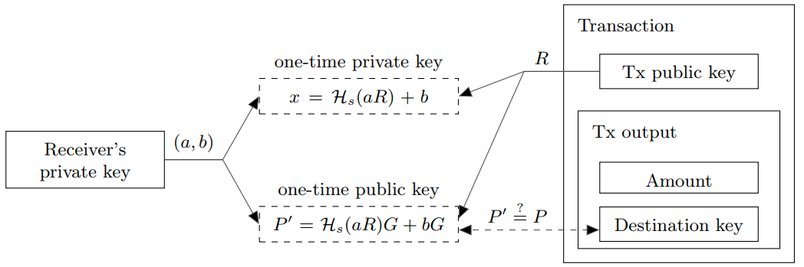

# PHBS_BlockChain_2018

## 1.Introduction

Block chain is a distributed bookkeeping technology in P2P network. It is a supporting technology behind many cryptographic currencies such as BTC and ETC. Because the books in block chain can only be written by additions and shared by all nodes in the network, even the nodes that do not trust each other can easily verify the data and rely on a certain consensus mechanism to achieve consistency. Block chain technology can significantly reduce the cost of trust among multiple nodes, so it has a wide range of application scenarios and value in cross-border payment, voucher business, supply chain and some financial fields.

Because different nodes need to compute and verify the same data, data on block chains are required to be public. This increases data transparency and credibility, but also brings another problem-data privacy. In block chains, some nodes may not want their own transaction data to be public, including the identity of both sides of the transaction, transaction funds. Quantity, contract content and so on. This is not only important for customers who pay attention to personal privacy, but also for financial system and supply chain system, data privacy is one of the key points of their profits. Therefore, in order to make the block chain have a wider use space, we need to take into account the multi-node trust characteristics of the block chain and ensure data privacy.

In response to this demand, a lot of research work has been proposed in recent years: in the field of cryptography currency, Dash, Monero and so on, they can solve the privacy problem of transaction data to a certain extent. The principles of privacy protection in the above studies are different. Some studies use a number of technologies to protect privacy, and the scenarios of block chains are different. I plan to summarize 2 kinds of mainly used privacy protection technologies of block chains: **Dash** and **Monero**

## 2.Privacy Problem of Block Chain

Bitcoin trading does not require the user's real identity, but block-chain technology such as Bitcoin is not an **anonymous** system. Strictly speaking, Bitcoin is an **pseudonym** system-- the so-called pseudonym, that is, an identity unrelated to the real identity we use in the network. 

But anonymity is different from pseudonym. In computer science, anonymity refers to the so-called unrelated pseudonym, that is, from the perspective of an attacker, it is impossible to correlate any two interactions between users and the system. In Bitcoin, because users repeatedly use public key hash values as transaction identifiers, it is obvious that transactions can be correlated. Bitcoin is not anonymous

## 3.Typical Block Chain Privacy Protection Methods

### 3.1 Dash

To achieve anonymity, we need to make currency fully interchangeable. Interchangeability is the property of currency, which decides that all units of currency should be equal. Currency should not have any connection with the transaction records made with that currency, so that all currencies are equal. At the same time, any user ensures that every transaction in public accounts is honest without affecting the privacy of others.

Dash coin uses a key technology called Coinjoin. Simply speaking, coin technology is a technology that mixes multiple transactions of multiple users (at least 3) through some master nodes to form a single transaction. In a coin, each user provides an input and output address, and then sends it to the main node for mixing (i.e., arbitrary exchange). Input and output addresses). Trading can only be done with 0.1, 1, 10, 100 Dash Coins, which makes it more difficult for attackers to guess the degree of transaction correlation from the perspective of amount.

#### 3.1.1 A simple way to mix all currencies: Coinjoin

A simple way to mix all currencies is to simply merge all transactions based on current BTC.

*Fig 1. Merge two user transactions into one Coinjoin transaction*

In this transaction, 0.05BTC are sent out using **Coinjoin**. In order to track the source of the funds, you only need to add up the amount on the right and match the amount on the left.

If we reconstitute the transaction, we will find that：
* 0.05 + 0.0499 + 0.0001(fee) = 0.10BTC
* 0.0499 + 0.05940182 + 0.0001(fee) = 0.10940182BTC

As more users join the **Coinjoin** process, the difficulty of getting results will increase exponentially. But it is still possible to trace back all transactions.

#### 3.1.2 Improved Coinjoin: Darksend

Darksend
* Merges multiple transactions into one transaction
* Uses the same face value of 0.1DASH, 1DASH, 10DASH and 100DASH
* Involves at least 3 transactions

*Fig 2. When 3 users'funds are merged into one common transaction, users will export funds in a new disrupted form.*

In order to deal with Denial-of service(DOS) attacks. Darksend stipulates that the user submits the transaction in the form of a deposit to the mine, so the user will provide the miners with high remuneration. That is to say, a deposit is required at the beginning of a user's request to the mixing pool. If the user does not cooperate at some time, such as refusing to sign, the deposit transaction will automatically broadcast over the whole network. The cost of persistent attacks on anonymous networks is extremely high.

The mixing limit of Darksend is 1000 DASH per round, and multiple rounds of mixing can mix a considerable amount of money anonymously. Each round of the Draksend process can be considered as an independent event to enhance the anonymity of user funds.

| Depth of the Chain(r)|Possible users(, n=3)|
|:------:|:------:|
|1   | 3   |
|3 |  27  |
|5  |  243   |
|7  |  2187   |

*Table 1. The number of users who may participate in r mixing sessions*

Through Darksend's multi-round mixing technology, the probability of tracking a single transaction decreases exponentially with the increase of the number of rounds. Besides, 2 tools also helps to enhance anonymity。

* **Chaining**：One transaction of a user will randomly chooses multiple Masternodes, and then mixes in these Masternodes in turn, and finally delivers one final output.

* **Blinding**：Instead of sending the input and output addresses directly to the mixing pool, the user randomly selects a Masternode to transfer the input and output to a designated Masternode, which makes it difficult for the latter Masternode to obtain the real identity of the user.

In this way, unless the attacker controls most Masternodes, it is almost impossible to trace back a specified transaction.

#### 3.1.3 Drawbacks

Although Dash has some improvement in anonymity compared with BTC, there is still some risks of privacy disclosure.

The disadvantages of centralized currency mixing: 

* Additional fees and slower speed of coinjoining
* The mixing process needs the participation of middlemen. There may be the risk that the middlemen are not honest enough and run away.

The disadvantage of de-centralized currency mixing: 
* Users need to find the Masternode to complete the mixing process, which brings the risk of centralization.
* Some malicious node violations may lead to failure.

### 3.2 Monero

Monero Coin proposes a hybrid encryption scheme independent of the central node. There are 2 key technologies of Monero Coin: **stealth addresses** and **ring signature**。

#### 3.2.1 Stealth addresses

**Stealth addresses** is to solve the problem of the relevance of the output address of the input. Each time a sender wants to initiate a transaction, he first calculates a one-time temporary intermediate address by using the public key information of the receiver, and then sends the amount to the intermediate address. The receiver then finds the transaction by using his own public and private key information, and then carries on the expense. In this way, other users on the network, including miners, can not determine who the intermediate address belongs to, but the validity of the transaction can still be verified, and since the address is one-time, each time it is randomly generated, the attacker can not make any association with the real sender and receiver.

To make the whole process clearer, here is an example as following. Suppose Alice wants to transfer money to Bob

1. Bob chooses 2 numbers `a` and `b` as his private key. According to the ECC curve, Bob calculates the corresponding public key `A=aG` and `B=bG`. `G` is a common base point on the curve. Bob broadcasts these 2 public keys `A` and `B` on the whole network.
1. Alice chooses a random integer `r` as another private key, and calculates 
1. Alice calculates `R=rG`
1. Alice broadcasts the transaction record and number `P` and `R` on the whole block chain. Because the hash function is used, according to these 2 open numbers (`P` and `R`) , no one can deduce how much `A` and `B` are, neither can it know the payee is Bob.

*Fig 3. Standard transaction structure*
1. Bob scans the whole blockchain, and calculates that . If this money is for Bob, he will find that *P'=P*(Because Alice uses *A* that Bob broadcasts, and calculates *R=rA*. According to ECC algorithm, *rA=aR*, so . So Bob knows that the money belongs to him.)
1. Bob calculates . `x` is the private key of public key `P`, because . The private key `x` can't even be figured out by Alice. So Bob can use this key to spend the money in the future.

*Fig 4. Incoming transaction check*

From the process above we can see that, the pressure is enormous for Bob, because he needs to scan all the transactions on the block chain, and then calculate the corresponding information for comparison to find the transactions sent to him. Monero coin has put forward an improved scheme for this purpose. We can notice that when calculating P', we only use `(a, B)`, which is half of the private key, and when calculating the final private key `x`, we must use `(a, b)`. So if a third party knows a, he can calculate P', but he can not calculate the corresponding private key `x` to spend the money. Because the third party doesn't know the other half of the private key *b*, Bob can give half of his private key `(a, B)` to the third party, thereby authorizing the third party to help check all transactions belonging to Bob on the block chain, thus reducing Bob's pressure, but ultimately only Bob can spend the money.

As we can see from the process above, different from BTC which only has one pair of keys(public key and private key), Menero has two pairs of keys(**spend key** and **view key**)

**Spend key**: `b`(private) and `B`(public). In spend key, the public key is used to join ring transaction and verify key image, and the private key is used to create a key image.

**View key**: `a`(private) and `A`(public). In view key, the public key is used to create **Stealth addresses**, and the private key is used to scan the whole blockchain and check whether there are some transactions sent to itself.

The sender calculates a temporary one-time stealth address by using the public key of the receiver's view key, and sends the money to the address. Then the receiver scans the block chain and finds that the transaction can take the money away by using the private key of his view key. Others on the network do not know who the transaction is sent to, only the recipient himself knowd, which ensures anonymity of transactions

#### 3.2.2 Ring Signature

A normal signature is shown below, with only one participant, allowing one-to-one mapping:

*Fig 5. Normal signature, one-to-one mapping*

But ring signature blurs authentication, because the receiver only knows that the message comes from someone in a group, but does not know which one in the group.

*Fig 6. Ring signature, many-to-many mapping*

Monero uses the [one-time ring signature technique](https://cryptonote.org/whitepaper.pdf) proposed in CryptoNote white paper. Simply speaking, this algorithm is to create an equation with multiple public keys, which can be solved by holding only one of the corresponding private keys. As we can see, each member has equal probability weights, so they can't determine which group member the signer is. As the group size increases, the probability of each member becoming a real signer decreases, which guarantees a high degree of anonymity.

To avoid **Double-Spending** attacks, Monero has a unique key image *I* for every transaction . The key images for each transaction are different. This mechanism ensures that each *P* can only be used once. The Monero network maintains a database containing all incomplete key images, so if a user tries to reuse the key, the network will reject the transaction.

#### 3.2.3 Drawbacks

Although **stealth addresses** can ensure that the addresses of the recipients change every time, so that the external attackers can not see the address correlation, they can not guarantee the anonymity between the sender and the recipient. 

Besides, **ring signatures** still need to be mixed with other users'public keys, so they may encounter malicious users to expose their privacy. 

**In addition, in 90% of cases, the size of the ring is between 2 and 4, so anonymity is greatly reduced.**

## 4.Comparison

| Name|Technical characteristics|Advantage|Disadvantage|
|:------:|:------:|:------:|:------:|
|Dash   | Coinjoining; Chaining; Blinding   | Intuitive  | Depend on Masternode |
|Monero |  Stealth address; Ring signature  | Independ of other nodes | Depend on public keys of others; In most cases the length of ring is very short (2-4)|

## 5.Conclusion

Privacy protection in block chain technology has always suffered a lot of criticisms. On the one hand, the transaction privacy of ordinary users on block chain should be protected, on the other hand, malicious users should be prevented from using it as a platform for illegal transactions. Current anonymity technology can not guarantee anonymity and decentralization perfectly, which also brings risks to users in transaction and privacy. I believe that with the emergence of new technologies, block chains can provide an open and credible technological support for the digital world while protecting privacy.

## Reference

[1] (n.d.). Retrieved from [https://bihu.com/article/1424993](https://bihu.com/article/1424993)
[2] Saberhagen, N. V. (n.d.). [CryptoNote v 2.0](https://cryptonote.org/whitepaper.pdf) (Publication
[3] Dash Coin Whitepaper. (n.d.). Retrieved from https://dashpay.atlassian.net/wiki/spaces/DOC/pages/5472261/Whitepaper
[4] Yu, Z., Au, M. H., Yu, J., Yang, R., Xu, Q., & Lau, W. F. (2019). New Empirical Traceability Analysis of CryptoNote-Style Blockchains. Financial Cryptography and Data Security (FC).Retrieved from https://fc19.ifca.ai/preproceedings/69-preproceedings.pdf
[5] 什么是门罗币？终极入门指南. (n.d.). Retrieved from https://blog.csdn.net/simple_the_best/article/details/79339579
[6] 达世币白皮书：一个专注于保护隐私的数字货币. (n.d.). Retrieved from https://www.8btc.com/article/69654
